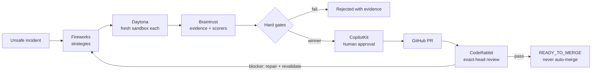

# SafeFlash

> **The safety gate for AI-generated firmware.**

SafeFlash makes firmware repairs compete on executable safety evidence before
any patch can approach a real device. A convincing patch that violates a
physical-safety invariant cannot win on average score.

> 🎬 **Demo GIF placeholder**
>
> Final capture: unsafe incident → candidates → hard-gate rejection → bound
> approval → review/revalidation. Replace only after the rehearsal is frozen.

**Pre-event competition baseline for the Daytona HackSprint w/ Braintrust,
July 2026.** The verified reference is the **Parallel Safety Tournament**:
multiple strategies run separately while every rejection remains visible.
The selected competition-day feature is **Cross-Device Assurance Profiles**,
summarized as “One safety gate, multiple classes of physical devices.” Its
Motor implementation must begin after the official hacking window opens and
must not be claimed before fresh day-of evidence exists. Policy Composer
remains a disabled roadmap surface, not a policy conversion or safety
transition.

## One-command demo

After the one-time `npm ci`, start the deterministic, no-credential console:

```powershell
npm run dev:competition
```

Open `http://127.0.0.1:3018`, click **Run Safety Tournament**, and keep
`MOCK • NOT PROVIDER-VERIFIED` visible. CLI evidence: `npm run demo:local`.

## How the safety gate works



### Sponsor map

| Boundary | Why it is necessary |
|---|---|
| **Fireworks AI** | Schema-constrained, diverse repair strategies. |
| **Daytona** | Exact-commit isolation, network block, server-owned commands. |
| **Braintrust** | Repeatable Dataset, Trace, Experiment, Eval-result provenance, scorers, and hard gates. |
| **CopilotKit** | Shared agent state and evidence-bound human control. |
| **GitHub** | One-use, approval-gated publication to an exact base. |
| **CodeRabbit** | Independent exact-head review and repair loop. |

### Safety guarantees enforced by the design

- Hard-gate failure is ineligible; score cannot compensate.
- Model output is data; frozen commands and patch boundaries protect tests,
  CI, policy, thresholds, binaries, and host execution.
- Every attempt has a unique sandbox identity; failed IDs cannot become proof.
- Approval binds exact patch/evidence/policy/source and is invalidated by change.
- Publication is one-use and exact-revision; SafeFlash has no merge operation.
- Missing, stale, unknown, or failed evidence stops rather than silently falls
  back.

## Evidence labels and current truth

| Label | Meaning | Allowed claim |
|---|---|---|
| `LIVE` | The current run called the named external provider and returned exact provider IDs/evidence. | Claim only that named boundary for that run. |
| `RECORDED_LIVE` | Immutable evidence replayed from an earlier real external run, including capture time and provider references. | Say “recorded live evidence,” never imply a fresh call. |
| `MOCK` | Deterministic local fixture, contract fake, or local process evidence. | Claim product behavior and local tests only, never sponsor execution. |

SafeFlash never silently falls back from `LIVE` to another label.
`SAFEFLASH_DEFAULT_MODE=cached` is reserved for the read-only recorded-live
service: it requires a schema-valid, digest-bound artifact at
`SAFEFLASH_RECORDED_LIVE_PATH` plus the server-only
`SAFEFLASH_RECORDED_LIVE_SIGNING_KEY`, verifies the HMAC-SHA-256 capture
attestation, rejects missing/invalid/wrong-key artifacts, and cannot accept
decisions. It never turns arbitrary cached or mock data into `RECORDED_LIVE`.

The interactive `npm run demo:live` path can mint that artifact only after the
same in-memory workflow reaches `READY_TO_MERGE` with authority-bearing
Fireworks, Daytona, Braintrust, GitHub, and CodeRabbit envelopes. It writes a
redacted, digest-bound and server-attested file below
`.safeflash/recorded-live/`; pre-READY, mock-shaped, stale-head, unsigned, or
wrong-key capture/replay attempts fail closed. The HMAC proves possession of
the capture secret; it is not public-key nonrepudiation.

A real public [CodeRabbit review on PR #1](https://github.com/Frankie744/safeflash-ai/pull/1)
completed a changes-requested → repair → approved exact-head cycle. That is real
external evidence for the GitHub/CodeRabbit boundary. It is not, by itself, the
complete five-provider artifact required by the recorded-live replay service.

```text
MOCK_DEMO=AVAILABLE
RECORDED_LIVE_PROVENANCE=NOT_AVAILABLE
LIVE_CERTIFIED=NO
```

**`LIVE_CERTIFIED=NO` for the complete product path.** The project does not yet
claim one uninterrupted Fireworks → Daytona → Braintrust → human approval →
GitHub publication → CodeRabbit repair/revalidation run with all provider
evidence captured together. The default demo therefore remains honestly
labelled `MOCK`.

## Development and verification

Prerequisites:

- Node.js 22+
- npm 10+
- Visual Studio C++ build tools with CMake for the native firmware fixture

```powershell
npm ci
npm run verify
```

After all intended changes are committed and `git status --short` is empty,
`npm run verify:p0` captures typecheck, production build, Vitest, Chrome
Playwright, the named P0 acceptance matrix, and secret scans in a
source-commit-bound SHA-256 evidence package. This proves the local contract; it
does not certify external providers.

On the clean competition branch, the read-only day-of drill is:

```powershell
npm run rehearsal
npm run verify:phase8
npm run evidence:verify -- artifacts/evidence/phase-8/<run-id>
```

`verify:phase8` runs TypeScript, unit/integration/adversarial tests, Playwright
Chrome, production build, secret scan, `npm audit`, P0 verification, and the
rehearsal before publishing a self-verified SHA-256 manifest. It does not create
a PR, push, merge, or call the live sponsor workflow.

Provider credentials belong only in an ignored server environment. Never put a
secret in source, evidence, logs, Git history, or a `NEXT_PUBLIC_` variable.

## Demo and judge handoff

- [Competition demo runbook](docs/demo-runbook.md)
- [Three-minute pitch](docs/three-minute-pitch.md)
- [Judge questions](docs/judge-questions.md)
- [Failure recovery](docs/failure-recovery.md)
- [Honest hardware demo boundary](docs/hardware-demo.md)
- [HackSprint new-feature plan](docs/hacksprint-new-feature-plan.md)
- [Competition readiness audit](docs/competition-readiness-audit.md)
- [Architecture](docs/architecture.md)
- [Setup and external smoke runbook](docs/runbook.md)
- [P0 judging map](docs/judging-map.md)
- [Historical build ledger](HACKATHON_BUILD.md)

Public source: [`Frankie744/safeflash-ai`](https://github.com/Frankie744/safeflash-ai).
