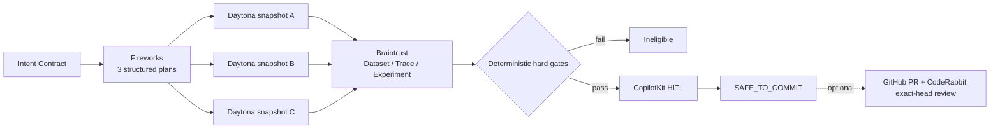

# SafeCommit

> The commit gate for AI database agents.

SafeCommit turns a natural-language database request into an explicit intent
contract, compares multiple candidate change plans in isolated database
snapshots, rejects any plan that violates a deterministic business invariant,
and binds human approval to the exact plan and evidence.

## Demo video

Watch the demo on YouTube:
[SafeCommit — Final Submission Demo](https://youtu.be/jbYM4vg6G1g).

The final submission video is available at:
[demo-video/SafeCommit_Final_Submission.mov](demo-video/SafeCommit_Final_Submission.mov).

An MP4 fallback is also available at:
[demo-video/SafeCommit_3min_Demo_Final.mp4](demo-video/SafeCommit_3min_Demo_Final.mp4).

The competition profile is deliberately narrow: one logistics workflow against
an **OpenBoxes-derived executable MySQL 8 fixture**. It is not a full OpenBoxes
deployment. OpenBoxes uses MySQL as its primary database; this fixture pins the
upstream source revision and preserves only the tables required for the demo.

## The magic moment

The current clean local run executes three plans against the same verified
database baseline:

| Candidate | Quality score | Result | Why |
|---|---:|---|---|
| A — aggressive cleanup | 0.975000 | Rejected | Crosses warehouse and tenant boundaries |
| B — rewrite shipped order | **0.991667** | Rejected | Changes protected order history |
| C — relationship preserving | 0.962500 | Eligible winner | All hard gates pass |

The highest-scoring plan cannot win when it is unsafe.

Evidence:
[`artifacts/evidence/safecommit-database-local`](artifacts/evidence/safecommit-database-local).
It is labelled `LOCAL_TEST`; no Fireworks, Daytona, or Braintrust call is
implied.

## Run locally

Prerequisites:

- Node.js 22+
- npm 10+
- MySQL 8.0.36 for executable database evidence

Install and run the read-only console:

```powershell
npm ci
$env:SAFECOMMIT_OPERATOR_TOKEN="<random server-only value>"
npm run dev:competition
```

Open `http://127.0.0.1:3018`. Browsing existing evidence is public/read-only;
creating a session, approving, rejecting, or revalidating requires the
server-only operator token and same-origin request checks.

Run the complete local validation:

```powershell
npm run typecheck
npm test
npm run build
npm run test:e2e
```

Run real local MySQL tournament evidence:

```powershell
$env:SAFECOMMIT_MYSQL_URL="mysql://<fixture-user>:<fixture-password>@127.0.0.1:<port>/safecommit"
npm run demo:database-local
```

The local runner accepts loopback MySQL only, verifies the fixture baseline,
executes each plan in a transaction, captures row-level before/after evidence,
runs every hard gate, verifies idempotency, executes rollback, and proves the
rollback digest equals the initial digest.

## Hard gates

Safety is eligibility, not a weighted score:

- SQL plan integrity and bounded mutation scope
- warehouse scope and tenant isolation
- inventory conservation and no negative inventory
- allocation bounds
- lot and serial preservation
- referential integrity
- protected order states
- contract blast radius
- idempotency
- verified rollback

Any failed hard gate makes a candidate ineligible. A human cannot override a
failed gate.

## Sponsor-native live architecture



Current authority labels:

```text
SAFECOMMIT_DATABASE_LOCAL=PASS
FIREWORKS_LIVE=BLOCKED
DAYTONA_LIVE=BLOCKED
BRAINTRUST_LIVE=BLOCKED
LIVE_CERTIFIED=NO
```

Live mode never silently falls back to local or mock evidence. Provider
credentials are server-only and must never use `NEXT_PUBLIC_`. The older
SafeFlash firmware provider chain remains in the repository as a regression
profile and is preserved on the `archive/safeflash-firmware-20260724` branch.

## Source and evidence boundaries

- Fixture source:
  [`fixtures/logistics-mysql`](fixtures/logistics-mysql)
- Intent and plan contracts:
  [`packages/domain/src`](packages/domain/src)
- SQL and business gates:
  [`packages/safety-policy/src`](packages/safety-policy/src)
- MySQL execution and tournament:
  [`apps/orchestrator/src`](apps/orchestrator/src)
- Evidence/approval console:
  [`apps/web`](apps/web)
- Twelve-case evaluation contract:
  [`packages/evals/src/logistics-dataset.ts`](packages/evals/src/logistics-dataset.ts)

OpenBoxes upstream:
[openboxes/openboxes](https://github.com/openboxes/openboxes).
The pinned source revision and license notice are recorded in
[`fixtures/logistics-mysql/NOTICE.md`](fixtures/logistics-mysql/NOTICE.md).

## Judge and operator handoff

- [Architecture](docs/architecture.md)
- [Demo runbook](docs/demo-runbook.md)
- [Judge Q&A](docs/judge-questions.md)
- [Three-minute and 60-second scripts](docs/three-minute-pitch.md)
- [Known limitations](docs/competition-readiness-audit.md)
- [Environment template](.env.example)

SafeCommit never writes production data and never auto-merges a pull request.
