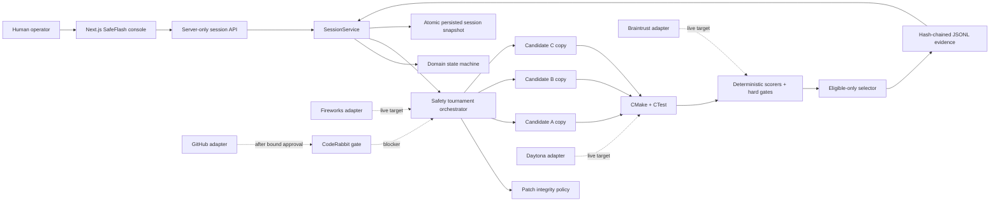

# SafeFlash architecture

SafeFlash is an evidence gate for AI-generated firmware. It is designed so a
candidate that merely looks plausible—or even earns a high weighted score—can
never cross the pull-request boundary unless deterministic build, test,
integrity, safety, approval, and independent-review conditions all hold.

## Verification boundary

This document describes both the implemented architecture and its current
verification status. They are deliberately not the same thing.

- **Verified locally:** a compiled C firmware fixture, three deterministic
  candidate patches, three unique local filesystem copies, real MSVC/CMake/
  CTest outcomes, non-compensable hard gates, hash-chained event evidence, a
  persisted Next.js console, and evidence-bound local human approval.
- **Implemented and contract-tested, but not verified live:** Fireworks,
  Daytona, Braintrust, GitHub, and CodeRabbit adapters.
- **Public source ready, live providers blocked:** the public repository is
  `https://github.com/Frankie744/safeflash-ai`, but there are no provider
  credentials or confirmed repository-scoped CodeRabbit GitHub App
  installation in the committed evidence. No provider ID, trace, sandbox, PR,
  or review is claimed.

The authoritative evidence ledger is
[`HACKATHON_BUILD.md`](../HACKATHON_BUILD.md). The strongest committed local UI
package is
[`artifacts/evidence/phase-4/phase4-evidence-20260722T223143361Z/`](../artifacts/evidence/phase-4/phase4-evidence-20260722T223143361Z/).

## System map



Solid lines are exercised by the committed local production-console evidence.
Dashed lines are implemented provider boundaries whose live execution remains
unverified.

## Component responsibilities

| Component | Responsibility | Current evidence |
|---|---|---|
| `fixtures/battery-controller/` | Minimal C battery controller with a deliberate disconnect/stale-sample/latch defect and deterministic unit/safety tests. | Phase 1 build and CTest logs. |
| `packages/safety-policy/` | Reject protected paths, test/CI/build/policy edits, threshold changes, traversal, binary/symlink/delete/rename patches, shell execution, network downloads, and oversized diffs. | Unit/adversarial tests; Phase 2 verification. |
| `packages/domain/` | Candidate schema, canonical evidence digests, eligibility, selection, approval binding, state transitions, and review gate. | Unit tests; Phase 2 verification. |
| `packages/evals/` | Ten stable firmware-safety incident definitions and eight deterministic scorer implementations. | Contract tests only; not a live Braintrust Dataset or Experiment. |
| `apps/orchestrator/` | Execute the local tournament, isolate candidate copies, run fixed commands, redact output, hash artifacts, append events, and replay evidence. | Phase 3 summary and 27-event JSONL chain. |
| `apps/web/` | Next.js console, session routes, persistent snapshot validation, candidate cards, provenance badges, timeline, and CopilotKit human-approval registration. | Phase 4 production build, Playwright screenshot, API session, and replay. |
| `packages/integrations/` | Fail-closed Fireworks, Daytona, Braintrust, GitHub, and CodeRabbit ports. | Integration contract tests; external smoke remains blocked. |

## Local tournament data flow

1. The server accepts only the fixed `battery-sensor-disconnect` incident and
   `tournament` run kind.
2. The orchestrator validates three repository-owned `CandidatePatch` objects.
3. Each candidate receives a unique path below
   `.safeflash/local-sandboxes/`; candidate processes receive an allowlisted
   environment that excludes provider secrets.
4. A server-owned sequence initializes Git, checks and applies the patch,
   configures and builds the fixture, then runs unit and safety CTest labels.
   CTest uses `--no-tests=error`, and each command has a timeout.
5. Command argv, exit code, duration, artifact hash, output hashes, commit SHA,
   sandbox ID, and provenance are converted into structured evidence.
6. The deterministic scorer set computes `BuildSuccess`,
   `UnitTestPassRate`, `SafetyInvariant`, `RegressionProtection`,
   `PatchIntegrity`, `PatchMinimality`, `ExplanationGroundedness`, and
   `Reproducibility`.
7. Only eligible candidates enter weighted selection. The selector does not
   use candidate names.
8. Twenty-seven append-only events are linked by SHA-256 hashes. Replay checks
   sequence, session identity, unique candidates/sandboxes, command binding,
   three completions, an eligible winner, and terminal ordering.
9. `SessionService` builds the console view from that evidence and writes an
   atomic JSON snapshot. Every later read revalidates the snapshot against the
   event chain, source commit, selected patch digest, evidence digest, and any
   approval.

The committed Phase 3/4 local result is intentionally asymmetric:

| Candidate | Build | Unit | Safety | Weighted score | Eligibility |
|---|---:|---:|---:|---:|---|
| A — range validation | pass | 5/5 | 0/6 | 0.897 | rejected: `SafetyInvariant` failed |
| B — retry/latch attempt | fail | 0/0 | 0/0 | 0.3465 | rejected: build, safety, and unit-rate gates failed |
| C — fail closed + latch | pass | 5/5 | 6/6 | 0.890 | eligible and selected |

Candidate A demonstrates the central safety property: a numerically higher
score cannot compensate for a failed hard gate.

## Hard gates and ranking

A candidate is eligible only when all four conditions hold:

```text
BuildSuccess == 1
AND SafetyInvariant == 1
AND PatchIntegrity == 1
AND UnitTestPassRate >= 0.95
```

The weighted score is evaluated only after eligibility:

```text
0.30 * RegressionProtection
+ 0.25 * UnitTestPassRate
+ 0.20 * PatchMinimality
+ 0.15 * ExplanationGroundedness
+ 0.10 * Reproducibility
```

When candidates tie, evidence digest and then candidate ID provide stable
ordering; neither can promote an ineligible candidate.

## Approval and review state machine

The full domain state machine is explicit:

```text
IDLE -> INGESTING_REPOSITORY -> ANALYZING_INCIDENT
     -> GENERATING_CANDIDATES -> PROVISIONING_SANDBOXES
     -> BUILDING -> RUNNING_TESTS -> SCORING -> SELECTING
     -> AWAITING_HUMAN_APPROVAL -> CREATING_PULL_REQUEST
     -> AWAITING_CODERABBIT
        -> REVIEW_PASSED -> READY_TO_MERGE -> COMPLETED
        -> REVIEW_BLOCKED -> REPAIRING_REVIEW_FINDINGS
                          -> REVALIDATING -> AWAITING_HUMAN_APPROVAL
```

Any failure can enter `FAILED`; a human can cancel the workflow. Approval binds
the candidate ID, patch digest, evidence digest, policy version, source commit,
approver, and timestamp. A change to any bound value invalidates approval.
Critical/High CodeRabbit findings block readiness, and a repair must present a
new server-normalized receipt derived from live Daytona command evidence and a
live Braintrust Experiment result before it can return to approval. The receipt
binds the session, policy, patch digest, current sandbox, post-patch Git tree,
scorer values, Experiment identity, repaired commit, target repository, and
sponsor evidence references. Session state separately tracks the complete
sandbox history and rejects reuse. SafeFlash has no merge operation.

The current local session stops at `AWAITING_HUMAN_APPROVAL` after recording
the decision. Its UI says **Approve evidence (no live PR)** and the backend
persists `pullRequest: undefined`. A local approval is not presented as a
GitHub transition.

## Provider boundaries

### Fireworks

The adapter sends a fixed safety-aware prompt, requests JSON Schema output at
temperature 0, validates the response again with Zod, enforces the requested
candidate ID/strategy, and permits at most two controlled attempts. The live
base URL is pinned to `https://api.fireworks.ai/inference/v1`. This code has
contract tests but no committed live request ID.

### Daytona

The adapter creates one private sandbox per candidate, clones an exact commit,
blocks network after the clone, uploads only a prevalidated patch, executes a
byte-for-byte frozen server-owned command policy, captures the patch digest and
post-patch `git write-tree` identity with structured command evidence, and
destroys the sandbox unless retention is explicitly enabled. Model-provided
test names are descriptive and never become commands. The managed API endpoint
is pinned to `https://app.daytona.io/api` to prevent key exfiltration. This code
has contract tests but no committed live sandbox ID.

### Braintrust

The adapter can seed the ten-row `Firmware Safety Incidents` dataset, flush a
trace/span, and run a candidate Experiment with the eight deterministic
scores. It refuses to call these artifacts real unless the SDK returns remote
dataset, trace, project, experiment, and URL identifiers. No such identifiers
exist in committed evidence.

### GitHub and CodeRabbit

GitHub PR creation requires a current approval whose candidate, evidence
digest, commit, trusted Daytona/Braintrust receipt, and validated Git tree
exactly match the published remote branch head. Before approval, a read-only
preparation step fetches the immutable GitHub base tree and only the
server-registered source blobs, applies the integrity-approved LF unified diff
as pure data, and computes the resulting blob, tree, and deterministic commit
object IDs. The computed tree must equal Daytona's `git write-tree` result;
this step creates no GitHub object, branch, or PR. After approval, the adapter
creates and verifies each blob, tree, and commit, then creates or fast-forwards
the stable `safeflash/<session>` ref without requiring an externally pushed
branch. It checks the configured base and stable ref before and after mutation
to fail closed on races. The session fixes owner, repository, base branch, and
base commit before approval. The adapter requires a public repository with
reported push permission, keeps the PR open and unmerged, and exposes no merge
API.

Create/update additionally requires a short-lived, server-only
`PublishAuthorization`. Its HMAC-SHA256 claims bind the session, candidate,
patch and evidence digests, publication parent and target-base commits,
approved commit, validated tree, complete prepared-publication digest, policy,
exact owner/repository/base target, stable head branch, PR content digest,
approval binding, validation receipt, and Daytona/Braintrust IDs and references. The
GitHub adapter validates and atomically consumes the nonce before its first
network call in the publication transaction; read-only source ingestion and
preparation are separate and cannot mutate refs. Production uses an exclusive-create replay store below
`.safeflash/`, so the same capability cannot be retried after success or
failure; a new mutation needs a newly minted authorization. Test authorities
are runtime-branded and cannot authorize an official SDK transport.

The CodeRabbit adapter accepts only official bot/app identities, evidence for
the exact PR head SHA, and an open unmerged PR against the configured base. It
normalizes review/check severity, rejects stale-head evidence, and rechecks the
PR at the end to close a time-of-check/time-of-use window. A structured manual
attestation is separately labelled `manual-verified`, never `live`. Neither a
real PR nor a CodeRabbit review has been verified in this workspace.

## Provenance model

| Kind | Meaning | May be described as provider-live? |
|---|---|---:|
| `live` | Captured from the named provider through its official SDK/API. | yes |
| `recorded-live` | Replay of a prior live artifact with capture time and evidence reference. | only as recorded evidence |
| `manual-verified` | Human attestation tied to a concrete review URL and actor. | no |
| `server-owned` | A SafeFlash server state transition, not evidence from an external provider or human attestation. | no |
| `local-test` | Real local execution or adapter contract test. | no |
| `mock` | Fixture-generated behavior. | no |
| `unknown` | Missing or unavailable capability/evidence; always unverified. | no |

Live adapters require both `SAFEFLASH_ALLOW_LIVE=true` and their complete
credential set. They fail closed and never silently downgrade to cached,
local-test, or mock results.

## Security properties

- Provider keys remain server-side and no provider secret is prefixed
  `NEXT_PUBLIC_`.
- `.env.local`, `.safeflash/`, build products, raw provider logs, and
  Playwright transient output are ignored by Git.
- Local child processes receive only an allowlisted operating-system/toolchain
  environment; provider variables are omitted.
- Patch paths and content are validated before execution. Existing tests,
  thresholds, CI, build scripts, policies, deletions, renames, binary patches,
  traversal, shell calls, and network-download code are forbidden.
- Daytona commands are fixed by the server, bounded by timeouts, and executed
  after network blocking.
- Evidence is canonicalized and SHA-256 bound; persisted UI state is rejected
  if it diverges from the event log. These public SHA-256 digests detect
  mutation but are not signatures and do not establish who produced evidence.
- The PR publication trust boundary is the server-secret HMAC authorization,
  exact approval/provider binding, and one-time nonce consumption; it is not
  the public revalidation receipt digest.
- Approval and review evidence are exact-revision objects, not mutable labels.
- PR creation and merge are separate; SafeFlash never merges.

### Current operator-authentication boundary

The hackathon console is intended for localhost or an access-controlled demo
network. Its create, decision, and retry endpoints do not yet authenticate an
end user; `SAFEFLASH_APPROVER_ID` identifies the configured demo operator but
is not an identity proof. Evidence binding prevents stale or changed patches
from being approved, but it does not stop another caller who can reach the API
from submitting a decision. Do not expose this build as a public approval
service. A public deployment requires an identity/session layer, same-origin
request enforcement, and an operator authorization policy; that product layer
is outside the current P0 demo boundary.

## Known gaps

1. The production live composition, async session API, progress observer,
   approval binding, publication/review resume, and UI bridge are implemented
   and locally contract-tested. This internal closure is not external provider
   evidence.
2. No Fireworks candidate, Daytona sandbox, Braintrust Dataset/Trace/
   Experiment, public GitHub PR, or CodeRabbit review is verified live.
3. CopilotKit v2 state/HITL hooks are present, but `/api/copilotkit` returns a
   clear 503 until a server-side model provider is configured. The visible
   console remains driven by the real session API.
4. The committed fallback is replayable/hash-verifiable evidence plus a
   production screenshot; it is not recorded-live provider evidence and no
   two-minute video is committed.
5. The local candidate copies are useful deterministic isolation for testing,
   but they are not a substitute for Daytona's remote security boundary.
