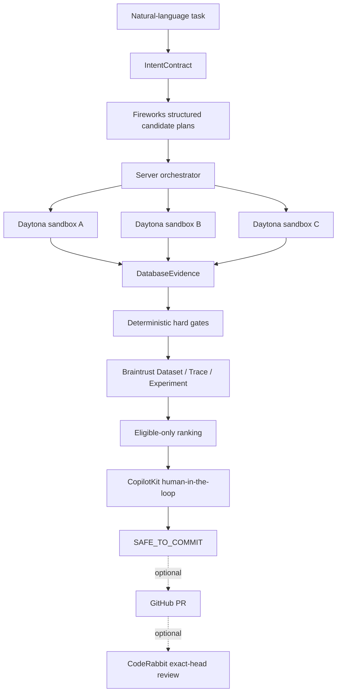

# SafeCommit architecture

## Product boundary

SafeCommit is a safety control plane for AI-proposed database changes. The
competition implementation supports one profile:
`openboxes-mysql-v1`, an OpenBoxes-derived executable MySQL 8.0.36 fixture.
It is not a complete official OpenBoxes deployment and it never connects to
production.

The old SafeFlash firmware workflow is preserved as a regression profile and
archive branch. It is not part of the SafeCommit judging flow.

## Control plane and data plane

The control plane owns intent, validation policy, fixed commands, evidence
digests, selection, and approval. Candidate plans are data. They cannot alter
tests, policy, validation SQL, shell commands, or provider configuration.

The live data plane exists only inside three unique ephemeral Daytona
sandboxes. Each starts from the same immutable database snapshot and source
commit. Network access is closed before untrusted execution. Cleanup is part of
the evidence contract; a sandbox that is not proven destroyed cannot count as
successful live evidence.

The currently verified data plane is local MySQL and is labelled `LOCAL_TEST`.

## Contracts

`IntentContract` freezes:

- database profile, tenant and warehouse scope;
- allowed tables and mutation operations;
- protected order states and affected-row limit;
- expected business effects;
- required invariants, rollback, and idempotency.

`CandidateChangePlan` contains schema-valid preconditions, bounded mutation
statements, expected effects, rollback statements, risks, and requested
validations. MySQL SQL is parsed into an AST before execution. DDL,
multi-statements, dynamic or external execution, out-of-contract tables, and
unbounded updates/deletes are rejected.

`DatabaseEvidence` binds the source commit, profile, plan, run and sandbox
identities, before/after state digests, row deltas, statement results,
idempotency state, rollback state, and gate outcomes.

`ApprovalBinding` binds the selected candidate, intent contract, database
snapshot, evidence digest, policy version, source commit, approver, and
timestamp. Revalidation or any evidence change invalidates the decision.

## Selection rule

1. Run deterministic hard gates.
2. Mark every failed candidate ineligible.
3. Rank only eligible candidates by weighted quality score.
4. If no candidate is eligible, fail closed.
5. Pause for human approval; humans cannot bypass a hard gate.

This prevents a high average score from compensating for wrong-warehouse
changes, lost inventory, invalid order history, or failed rollback.

## Web security boundary

Public, unauthenticated access is read-only. Mutations require:

- exact same-origin `Origin` and `Referer`;
- a server-only `SAFECOMMIT_OPERATOR_TOKEN`;
- the SafeCommit operator header;
- bounded in-memory rate limiting;
- Zod validation and opaque error responses.

The browser never receives MySQL or provider secrets. There is no production
database connector and no merge operation.

## Evidence authority

| Label | Meaning |
|---|---|
| `LOCAL_TEST` | Executed on the local MySQL fixture; no sponsor call |
| `MOCK` | Deterministic UI or contract fixture |
| `RECORDED_LIVE` | Immutable signed capture from an earlier live run |
| `LIVE` | The named provider was called in the current run |
| `BLOCKED` | Required authority, credential, environment, or evidence missing |

The complete chain may use `LIVE_CERTIFIED=YES` only when all named providers
complete one uninterrupted run bound to the same source commit.
