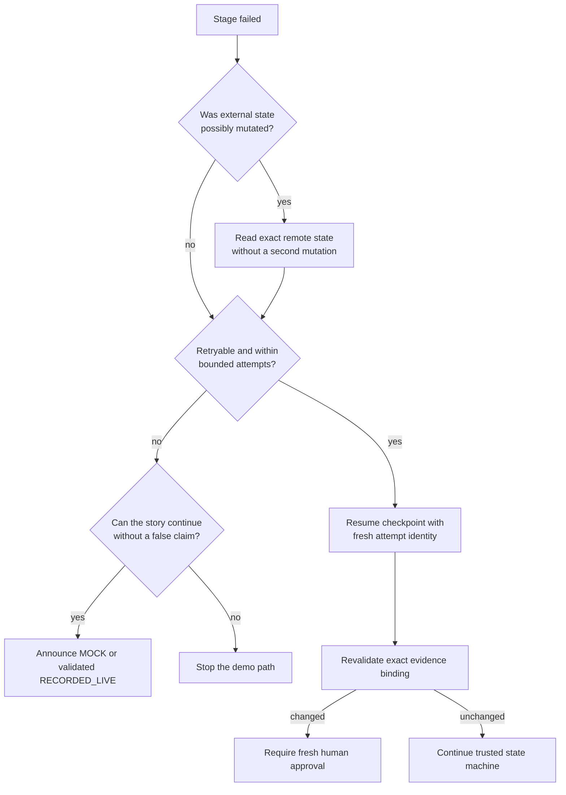

# SafeFlash failure recovery

SafeFlash recovers by preserving evidence and re-entering a trusted state, not
by changing a red result into green. This guide covers competition operations;
it does not authorize destructive provider or repository actions.

## Recovery rules

1. Preserve the first error and its redacted evidence.
2. Confirm the visible provenance label before retrying.
3. Retry only errors classified as transient and only within the bounded stage
   policy.
4. Never reuse a failed or discarded sandbox identity.
5. Never reuse a publication authorization after a GitHub mutation attempt.
6. Any patch, policy, source, base, or evidence change invalidates approval.
7. Switch to `MOCK` or a validated `RECORDED_LIVE` artifact only as an explicit
   operator decision.
8. SafeFlash never merges.

## Competition decision tree



## Stage recovery matrix

| Failure | Safe response | Never do |
|---|---|---|
| Fireworks configuration or authentication | Stop before candidate generation; correct the server-only configuration off-screen. | Substitute fixture candidates while leaving a `LIVE` badge. |
| Fireworks malformed structured output | Use only the bounded schema-repair attempt; preserve the rejected response metadata without secrets. | Hand-edit the candidate JSON or relax the schema. |
| Daytona create failure | Record the failed reservation and retry with a new monotonic run/attempt identity only if transient. | Claim a sandbox existed or reuse the reserved ID. |
| Daytona command failure | Stop subsequent commands, capture the failed step, and synchronously request cleanup. Candidate remains ineligible. | Continue to scoring as though later commands passed. |
| Daytona cleanup failure | Mark cleanup as failed, retain the sandbox ID for operator cleanup, and block that receipt from approval. | Hide the residual resource or call it destroyed. |
| Braintrust Dataset/Trace/Experiment failure | Stop scoring/selection for the affected receipt; retry only under the provider policy. | Copy a local score into a `LIVE` Braintrust result. |
| No eligible candidate | End the tournament with the hard-gate reasons visible. | Select the highest average ineligible candidate. |
| Approval mismatch | Reload the authoritative session and ask the operator to review the new exact binding. | Reapply an old approval after a patch or evidence change. |
| GitHub base drift | Stop before writes or after the consistency reread; refresh from the new immutable base and restart validation. | Force-push, silently rebase, or publish against an unapproved base. |
| Ambiguous GitHub write response | Read the exact branch/commit/PR state, then resume idempotently with a fresh one-use authorization. | Blindly create a second branch or PR. |
| CodeRabbit pending | Continue bounded polling or stop and show the PR page as pending. | Convert absence of findings into approval. |
| CodeRabbit blocking finding | Enter the repair state, generate a new patch, use fresh Daytona/Braintrust evidence, and request fresh human approval. | Update the PR and jump directly to ready. |
| CodeRabbit head/base changes during review | Mark prior review evidence stale and inspect the new exact revision. | Accept a comment or check from the old SHA. |
| Session/evidence corruption | Quarantine the files for diagnosis and create a new session from a clean committed source. | Hand-edit the snapshot or hash chain. |

## Local console failures

### Port already in use

Stop only the known SafeFlash process or start the development server on an
explicit unused port supported by the web workspace. Do not terminate unrelated
system processes. Confirm the browser URL before the clock starts.

### Session creation returns a source-integrity conflict

Run:

```powershell
git status --short
git rev-parse HEAD
```

The workflow requires a clean committed validation source. Commit the intended
work through the normal review path or switch to the previously verified
fallback. Do not weaken the source-integrity guard.

### Persisted session reports corruption

Preserve `.safeflash/sessions` for diagnosis, start a fresh session, and show the
last committed evidence package if time is limited. A manually repaired JSON
file is not evidence.

### Native firmware toolchain is unavailable

Confirm the documented Visual Studio C++ and CMake installation. If it cannot
be restored inside the presentation window, announce `MOCK` and use the
committed production evidence walkthrough. Do not replace build output with a
fabricated log.

### Browser layout or projection fails

Use the rehearsed 1440×900 viewport, reset zoom, and keep the incident,
candidate grid, and approval panel visible. If the live page remains unusable,
show the committed screenshot with its manifest and call it local recorded
evidence, not a live browser run.

## Provider preflight fails before the presentation

Run providers separately so one missing credential does not obscure the rest:

```powershell
npm run smoke:external -- --provider=fireworks
npm run smoke:external -- --provider=daytona
npm run smoke:external -- --provider=braintrust
npm run smoke:external -- --provider=github
npm run smoke:external -- --provider=coderabbit
```

Interpret exit status and the redacted `reason`; never paste a key into the
terminal output or evidence. If any required provider remains blocked, use the
recommended deterministic demo and report the successful CodeRabbit PR #1
boundary separately as real prior external evidence. Do not call that partial
boundary the formal all-provider `RECORDED_LIVE` artifact.

## Network failure during the three-minute demo

Use this exact handoff:

> The external path has stopped fail-closed. I am switching to the deterministic
> `MOCK` fallback; I will show the previously captured CodeRabbit review
> separately as real prior external boundary evidence, not as a fresh run or a
> complete recorded-live replay.

Then:

1. Stop waiting for the provider UI.
2. Open the deterministic console or last committed screenshot.
3. Show the candidate hard-gate decision and evidence-bound approval.
4. Open [PR #1](https://github.com/Frankie744/safecommit-ai/pull/1) only if the
   page is already available; otherwise use the prepared captured artifact.
5. Close with `LIVE_CERTIFIED=NO`.

## Secret exposure response

If a credential appears in a terminal, browser, screenshot, or artifact:

1. Stop screen sharing.
2. Treat the credential as compromised and revoke it at the provider.
3. Preserve the private diagnostic context without committing or sharing it.
4. Remove the value from local files and process environments.
5. Scan the frontend bundle, tracked files, evidence staging, and reachable Git
   history.
6. Generate a replacement credential only after containment.

Do not attempt to “redact” a committed secret by adding a later commit and
continuing the demo.

## Residual-resource check

After any interrupted live attempt:

- Inspect the known Daytona attempt IDs and remove only confirmed SafeFlash
  residual sandboxes through the provider console.
- Inspect the configured GitHub branch and PR; do not delete intentional review
  evidence without operator approval.
- Confirm no second PR or force update occurred.
- Record cleanup status alongside the failed run.
- Revoke temporary credentials and clear the operator-controlled environment.

## Stop conditions

Stop the live path and use the fallback when:

- provenance cannot be established;
- source, base, head, policy, patch, or evidence binding is ambiguous;
- an external mutation may have happened but cannot be read back;
- cleanup status is unknown;
- the only way forward would be to weaken a safety gate;
- credentials or private data may be exposed;
- remaining presentation time is shorter than the rehearsed recovery window.
