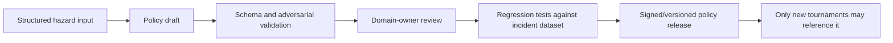

# SafeFlash HackSprint new-feature plan

## Implemented HackSprint feature: Parallel Safety Tournament

The competition feature built during the HackSprint is the **Parallel Safety
Tournament**.

It changes the product from a single-answer code fixer into an evidence
tournament:

1. one incident and immutable policy define the shared problem;
2. Fireworks produces distinct, schema-constrained repair strategies;
3. each candidate has a separate Daytona attempt identity;
4. build, tests, integrity, and physical-safety evidence feed Braintrust;
5. hard-gate failures make a candidate ineligible before ranking;
6. the UI preserves every rejection and explains the selected eligible patch;
7. a human approves an exact evidence binding;
8. CodeRabbit can send the exact PR head through repair and full revalidation.

This is the core competition narrative and the primary product innovation. It
is part of the implemented workflow and its local/provider contracts.

## Reserved follow-on: Policy Composer

**Status: reservation surface only; core conversion design is not implemented.**

The Policy Composer currently reserves a server-only flag, a read-only empty
state, a strict structured fixture schema, and a test fixture. It is not part of
any safety-critical state transition. No current demo should claim that natural
language is converted into an enforced policy.

Its purpose would be to help a domain expert draft a versioned safety-policy
proposal from structured intent while keeping activation separate and
human-controlled.

### Non-goals

- It does not auto-activate a generated policy.
- It does not change thresholds in the active tournament.
- It does not replace executable safety tests.
- It does not infer electrical or regulatory requirements from a datasheet.
- It does not grant Fireworks or another model authority over hard gates.
- It does not mark a draft as validated because its schema parses.

### Reserved feature flag

The server-only reservation flag is:

```text
SAFEFLASH_ENABLE_POLICY_COMPOSER=false
```

Its current contract is deliberately limited:

- absence, an unknown value, or `false` leaves the reservation off;
- exact `true` reveals only the empty state, never a conversion form;
- it must not use a `NEXT_PUBLIC_` variable as the authorization boundary;
- disabling it must leave the current tournament behavior unchanged.

### Proposed input interface

```ts
interface PolicyComposerInput {
  policyId: string;
  basePolicyVersion: string;
  deviceClass: string;
  hazard: {
    title: string;
    severity: "low" | "medium" | "high" | "critical";
    unsafeOutcome: string;
  };
  signals: readonly {
    name: string;
    unit?: string;
    validRange?: { minimum: number; maximum: number };
    missingEvidenceBehavior: "fail-closed" | "hold-last-value-prohibited";
  }[];
  allowedPatchPaths: readonly string[];
  protectedPaths: readonly string[];
  requiredTestIds: readonly string[];
}
```

Inputs are structured deliberately. Free-form prose may accompany a field as an
operator note, but it must not be the sole source of a threshold or protected
path.

### Proposed draft interface

```ts
interface PolicyComposerDraft {
  schemaVersion: 1;
  status: "draft";
  basedOnPolicyVersion: string;
  proposedPolicyVersion: string;
  invariants: readonly {
    id: string;
    statement: string;
    hardGate: true;
    evidenceRequirements: readonly string[];
  }[];
  patchBoundary: {
    allowedPaths: readonly string[];
    protectedPaths: readonly string[];
    maximumChangedFiles: number;
    maximumChangedLines: number;
  };
  unresolvedQuestions: readonly string[];
  sourceAttributions: readonly string[];
  draftDigest: string;
}
```

The output status is always `draft`. A separate review process would need to
validate schema, thresholds, test coverage, source attribution, and policy
regression before producing a version that the tournament can reference.

### Reserved UI empty state

When the flag is absent or false:

> **Policy Composer is not enabled**
>
> SafeFlash is using the repository-owned, versioned safety policy. Draft
> composition is a planned feature and is not part of this validation run.

The empty state must not show fake drafts, animated conversions, sample model
confidence, or an enabled “Activate” action.

When the flag is true:

> **No policy conversion is implemented**
>
> Start from a reviewed base policy and structured hazard inputs. Drafts cannot
> change an active tournament or become approval evidence.

The reserved page must remain read-only: no form, textarea, conversion action,
policy mutation, or activation action.

### Fixture reservation and proposed expansion

The reservation uses a strict structured fixture schema and one
`test-fixture`-provenance example. Future implementation may expand it with:

```text
tests/fixtures/
  safety-policy-composer.fixture.json
  battery-sensor-disconnect.input.json
  battery-sensor-disconnect.expected-draft.json
  incomplete-threshold.input.json
  malicious-protected-path.input.json
  ambiguous-unit.input.json

packages/domain/src/
  composer-contract.ts

tests/unit/
  policy-composer-contract.test.ts

tests/adversarial/
  policy-composer-boundary.test.ts
```

Fixture expectations:

- missing units or thresholds remain unresolved instead of being invented;
- protected paths cannot move into the allowlist;
- existing hard gates cannot be downgraded;
- unknown fields and non-finite numbers fail schema validation;
- prompt-like text remains inert data;
- source attribution and base policy version are mandatory;
- repeated canonical input produces the same draft digest;
- no draft can be consumed by the active workflow.

### Proposed activation design

Activation is intentionally outside the composer:



Every arrow after draft creation represents unimplemented future work. The
current repository-owned policy remains the only authority.

### Exit criteria before implementation may be claimed

- feature flag and empty state are tested fail-closed;
- draft schemas reject incomplete and hostile inputs;
- no route can activate or mutate the current policy;
- policy regression runs against the incident Dataset;
- a human domain-owner decision is authenticated and audited;
- the released policy is versioned and bound to subsequent evidence;
- the current Parallel Safety Tournament passes unchanged with the flag off.

Until all exit criteria have evidence, describe Policy Composer as a reserved
empty state and planned interface, not a policy-conversion capability.
