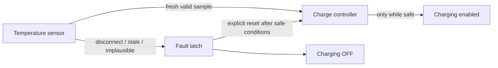

# SafeFlash hardware demo boundary

## Honest description

SafeFlash currently demonstrates **hardware-risk logic with a native C software
fixture**. It is not connected to a battery, charger, ADC, GPIO, MCU, RTOS, or
hardware-in-the-loop rig.

The web console also has an optional, non-blocking telemetry adapter. It can
display two externally supplied fields from HTTP or a user-routed serial JSON
frame, but that adapter is not safety evidence and does not turn this fixture
into hardware-in-the-loop validation. With no fresh external sample, the UI
must say `SIMULATED DEVICE`.

That distinction is intentional:

- the firmware source is real C and is compiled by a native toolchain;
- the safety oracle executes deterministic tests against controller state;
- candidate patches can fail compilation, behavior, or safety invariants;
- the result is evidence about firmware logic;
- it is not evidence about electrical behavior or a production target.

Use the phrase:

> This is a real compiled firmware fixture that models a physical-risk failure.
> It is not a connected board or HIL test.

## Fixture model

The fixture lives under `fixtures/battery-controller/`.

`BatterySensorSample` models:

- integer temperature in degrees Celsius;
- a sensor-fault signal;
- whether the sample is fresh.

`BatteryController` models:

- whether charging is enabled;
- whether a fault is latched;
- the current fault code;
- cycles without an updated sample.

The repository-owned safety policy includes:

- an inclusive valid temperature range;
- a maximum stale-sample interval;
- fail-closed behavior for a disconnected sensor;
- charging disabled when a fault is latched;
- explicit reset before controlled recovery.

The unsafe baseline deliberately demonstrates why compilation is insufficient:
it counts stale samples without enforcing the stale limit, ignores the explicit
sensor-fault signal, and allows normal input to clear state that should remain
latched. Range handling alone therefore cannot make the controller safe.

## What the demo proves

The native fixture proves that:

- unsafe firmware can build successfully;
- a physical-risk scenario can be expressed as an executable safety oracle;
- superficially plausible repairs can remain ineligible;
- an approval decision can be bound to the exact source, patch, and evidence;
- the same failure evidence can be preserved for replay and judge inspection.

It does not prove:

- ADC accuracy, sensor bias, noise, or open-wire electrical detection;
- charger FET polarity, reset defaults, or hardware fail-safe state;
- interrupt latency, watchdog behavior, RTOS scheduling, or race freedom;
- target flash/RAM usage, cross-compiler behavior, or MCU ABI;
- thermal dynamics, battery chemistry, or regulatory compliance;
- signed firmware, bootloader, programming, or deployment behavior.

## Operator demo

### Reproduce the unsafe baseline

```powershell
npm run test:firmware
```

The wrapper expects the unsafe safety suite to expose the repository-defined
faults. It records the native configure, build, unit, and safety output as
evidence. Do not reinterpret the expected unsafe baseline as a passing
production controller.

### Run the tournament

```powershell
npm run demo:local
```

Show:

1. the sensor-disconnect incident;
2. the immutable policy invariants;
3. separate candidate execution identities;
4. rejected build or safety evidence;
5. the highest eligible candidate and exact approval binding.

The local run uses real native processes and local filesystem isolation. It is
still `MOCK` with respect to Fireworks, Daytona, Braintrust, GitHub, and
CodeRabbit.

## Optional device telemetry

The presentation-only telemetry contract accepts exactly:

```json
{
  "sensor_temperature": 38.5,
  "charger_enabled": false
}
```

For HTTP, a local bridge may send that body to:

```text
POST /api/device
Content-Type: application/json
```

The route rejects unknown fields and returns `HTTP DEVICE` only while the
sample remains fresh. The in-process serial adapter accepts the same object, or
one newline-delimited JSON frame, together with an optional operator-provided
device identifier. SafeFlash does not discover ports and never assumes a name
such as `COM3` or `/dev/ttyUSB0`; selecting and reading a port remains the
responsibility of a separate bridge.

External telemetry expires after five seconds by default. Expiry or absence
does not block the web demo: the console switches to its software fixture and
shows all of the following boundaries:

```text
SIMULATED DEVICE
connected=false
simulated=true
```

`HTTP DEVICE` and `SERIAL DEVICE` describe only the transport that supplied the
two display fields. They do not authenticate a board, affect the safety
tournament, authorize a firmware decision, or prove physical behavior.

## Explain the physical risk in one diagram



The dangerous baseline effectively allows a disconnect to bypass the fault
latch. The safety candidate must route missing evidence to charging off and
must not let one later normal-looking sample erase the latched fault.

## Path to real hardware-in-the-loop

The next hardware milestone should preserve the existing controller policy and
replace only the evidence adapters.

### Proposed interfaces

```c
typedef struct BatteryHal {
    bool (*read_temperature)(int32_t *temperature_c);
    bool (*read_sensor_fault)(void);
    void (*set_charging_enabled)(bool enabled);
    uint32_t (*monotonic_milliseconds)(void);
} BatteryHal;
```

This interface is a plan, not current fixture code. A production version also
needs explicit active level, reset state, error semantics, time units, and
thread/interrupt ownership.

### Planned validation layers

1. Cross-compile the same controller for a named MCU and record toolchain,
   map-file, warning, and resource evidence.
2. Bind firmware artifact digest and board identity before programming.
3. Use isolated instrumentation to inject disconnect, stale, boundary,
   out-of-range, and recovery sequences.
4. Measure the physical charge-enable output and response deadline independently
   of firmware logs.
5. Record power/reset/watchdog behavior and fail-safe output polarity.
6. Return HIL receipts through a signed evidence adapter before allowing an
   approval-grade claim.

### Planned edge-case fixtures

- stale interval immediately before, at, and after the threshold;
- stale counter saturation rather than wraparound;
- simultaneous disconnect, stale, and range faults with defined priority;
- repeated fault updates and first-fault retention;
- reset attempts while the unsafe input remains present;
- long state-sequence and property-based tests;
- null/error returns at the HAL boundary;
- watchdog reset and brownout during charging.

Until those layers exist, use “hardware-risk fixture,” not “hardware-validated
firmware.”
